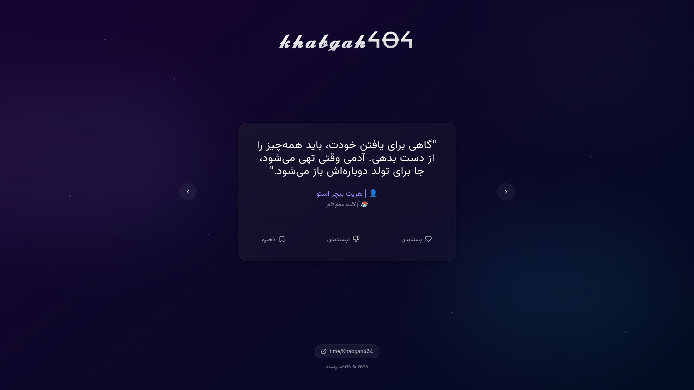

# 🛏️ Khabgah404
web : https://khabgah404.ir
<br>
A minimal and modern web page built using **TypeScript**, **Tailwind CSS**, **Vite**, and **Bun**. This project is intended for learning and experimenting with modern frontend development tools.

## ⚙️ Tech Stack

* ⚡ **Vite** – Fast build tool for modern web projects
* 🎨 **Tailwind CSS** – Utility-first CSS framework
* ✨ **TypeScript** – Strongly typed JavaScript
* 🍞 **Bun** – All-in-one JavaScript runtime & package manager

## 🚀 Getting Started

Clone the repository and run the development server:

```bash
git clone https://github.com/mamadmeraj/khabgah404.git
cd khabgah404
npm i
npm run dev
```




Then open your browser at: [http://localhost:3000](http://localhost:3000)


## 📁 Project Structure

* `index.html` – Main HTML file
* `src/` – TypeScript source code
* `tailwind.config.ts` – Tailwind CSS config
* `vite.config.ts` – Vite configuration

## 📌 Notes

This project is built for practice and demo purposes. Feel free to fork and customize it as needed.
